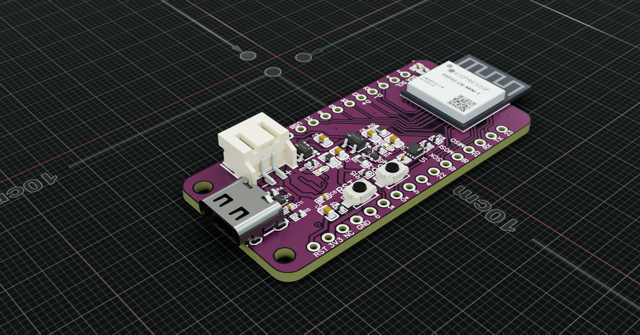

# ePulse Feather C6

## Specification
 * 18-33uA in deep sleep
 * VIN: 3.3 – 6V
 * ESP32-C6-MINI-1 (ESP32-C6H4)
 * 4MB Flash
 * Access to 20 GPIO pins
 * LiPo charging circuit
 * MAX17048 Fuel Gage
 * Follows Adafruit Feather form factor specification
 * Includes male header pins (1×12 and 1×16)

Link to shop: https://thingpulse.com/product/epulse-feather-low-power-esp32-c6/

## Documents

* [Schematic](Schematic-ePulse-Feather-C6.pdf)
* [3D Model (Step)](ePulseFeatherC6.step)
* [Pin Out](ePulseFeatherC6-Pinout.pdf)

## Video

