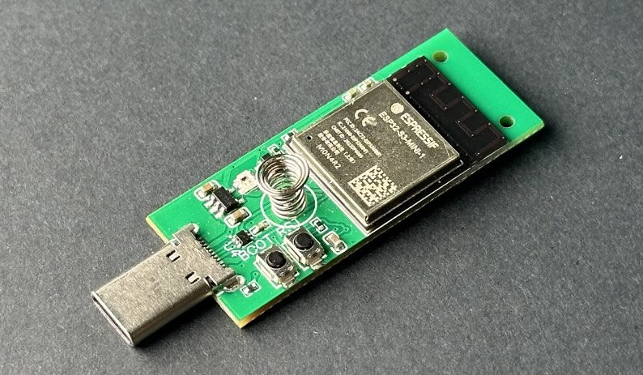

# Pendrive S3

## Specification
 * ESP32-S3-MINI-N4R2
 * 4MB Flash
 * 2MB SPRAM
 * 1Gbit LGA-8(6x8) NAND FLASH (CSNP1GCR01-BOW)
 * WS2812B RGB LED
 * Male USB-C Connector
 * Includes male header pins (1×12 and 1×16)

Link to shop: https://thingpulse.com/product/esp32-s3-pendrive-s3-128mb/

## Documents

* [Schematic](pendrive-s3-schematic.pdf)
* [3D Model (Step)](pendrive-s3.step)
* [Sample Projects on Github](https://github.com/ThingPulse/pendrive-s3-samples)

## Videos

* 
* 
* 
